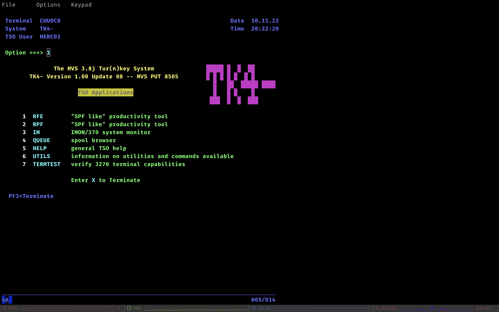

# C3270 - ncurses 3270 (mainframe) terminal emulator
As minimal as possible. Other images I found were bigger than 10MB, so created my own.

Tried it briefly with a local MVS 3.8J TK4 setup, and it works like a charm:

If you have a mainframe in handy, then you can simply log into that :P I sadly don't...

To try it yourself in a local way (like the screenshot), you can install Hercules, and [download TK4](https://wotho.ethz.ch/tk4-/). The TK4 version is `current`, and the docs come in handy for passwords etc. Lots of fun stuff you can do like installing [BRexx370](https://github.com/mvslovers/brexx370), [Kicks (CICS replacement)](http://www.kicksfortso.com/), compiling COBOL and PL/I programs, run JCL jobs etc. Been years since I did these things, but wanted an image setup up for testing again :) (hopefully useful for someone selse than me). 

Used this for testing (C3270 terminal part): `docker run --rm -it --add-host="localhost:myip" themkat/c3270` (where myip is my local ip, and themkat/c3270 is my built image). Then it was just a matter of `c3270 localhost:3270`, logging in and ready to go :) If you log in to a real mainframe, you don't need the add-host stuff, and can directly connect to its IP.

[man page for c3270](https://wotho.ethz.ch/tk4-/).
